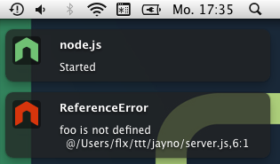
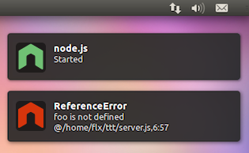

[](http://travis-ci.org/fgnass/node-dev)

### node-dev (1)

Node-dev is a development tool for [Node.js](http://nodejs.org) that
automatically restarts the node process when a file is modified.

In contrast to tools like [supervisor](https://github.com/isaacs/node-supervisor) or [nodemon](https://github.com/remy/nodemon) it doesn't scan the filesystem for files to be watched. Instead it hooks into Node's `require()` function to watch only the files that have been _actually required_.

This means that you don't have to configure any include- or exclude rules. If you modify a JS file that is solely used on the client-side but never run on the server, **node-dev will know** this and won't restart the process.

This also means that you **don't have to** configure any file extensions. Just require a `.json` file or a `.ts` script for example and it will be watched. Automatically.

# Usage

Just run `node-dev` as you would normally run `node`:

```
node-dev server.js
```

## TypeScript support

You can use node-dev to watch and restart TypeScript projects. Install [ts-node](https://www.npmjs.com/package/ts-node) as dev-dependency, then use node-dev to run your script:

```
node-dev src/server.ts
```

## Command-line options

There are a couple of command-line options that can be used to control which files are watched and what happens when they change:

- `--clear` - Clear the screen on restart
- `--debounce` - Debounce change events by time in milliseconds (non-polling mode, default: 10)
- `--dedupe` - [Dedupe dynamically](https://www.npmjs.org/package/dynamic-dedupe)
- `--deps`:
  - `-1` - Watch the whole dependency tree
  - `0` - Watch only the project's own files and linked modules (via `npm link`)
  - `1` (_Default_) - Watch all first level dependencies
  - `<number> ` - Number of levels to watch
- `--fork` - Hook into child_process.fork
- `--graceful_ipc <msg>` - Send 'msg' as an IPC message instead of SIGTERM for restart/shutdown
- `--ignore` - A file whose changes should not cause a restart
- `--interval` - Polling interval in milliseconds (default: 1000)
- `--notify=false` - Disable desktop notifications
- `--poll` - Force polling for file changes (Caution! CPU-heavy!)
- `--respawn` - Keep watching for changes after the script has exited
- `--timestamp` - The timestamp format to use for logging restarts
- `--vm` - Load files using Node's VM

## Passing arguments to node

All command-line arguments that are not `node-dev` options are passed on to the `node` process.

Please note: you may need to separate your script from other command line options with `--`, for example:

`node-dev --some-node-args -- my-script.js`

# Installation

`node-dev` can be installed via `npm`. Installing it with the `-g` option will allow you to use it anywhere you would use `node`.

```
npm install -g node-dev
```

### Desktop Notifications

Status and error messages can be displayed as desktop notification using
[node-notifier](https://www.npmjs.org/package/node-notifier):





**Requirements:**

- Mac OS X: >= 10.8
- Linux: `notify-osd` or `libnotify-bin` installed (Ubuntu should have this by default)
- Windows: >= 8, or task bar balloons for Windows < 8

# Config file

Upon startup node-dev looks for a `.node-dev.json` file in the following directories:

- the user's home directory
- the current working directory
- the same directory as the script to run

Settings found later in the list will overwrite previous options.

## Configuration options

Usually node-dev doesn't require any configuration at all, but there are some options you can set to tweak its behaviour:

- `clear` – Whether to clear the screen upon restarts. _Default:_ `false`
- `dedupe` – Whether modules should by [dynamically deduped](https://www.npmjs.org/package/dynamic-dedupe). _Default:_ `false`
- `deps` – How many levels of dependencies should be watched. _Default:_ `1`
- `fork` – Whether to hook into [child_process.fork](http://nodejs.org/docs/latest/api/child_process.html#child_process_child_process_fork_modulepath_args_options) (required for [clustered](http://nodejs.org/docs/latest/api/cluster.html) programs). _Default:_ `true`
- `graceful_ipc` - Send the argument provided as an IPC message instead of SIGTERM during restart events. _Default:_ `""` (off)
- `ignore` - A single file or an array of files to ignore. _Default:_ `[]`
- `notify` – Whether to display desktop notifications. _Default:_ `true`
- `poll` - Force polling for file changes, this can be CPU-heavy. _Default:_ `false`
- `respawn` - Keep watching for changes after the script has exited. _Default:_ `false`
- `timestamp` – The timestamp format to use for logging restarts. _Default:_ `"HH:MM:ss"`
- `vm` – Whether to watch files loaded via Node's [VM](http://nodejs.org/docs/latest/api/vm.html) module. _Default:_ `true`

### ESModules

When using ESModule syntax and `.mjs` files, `node-dev` will automatically use a loader to know which files to watch.

### Dedupe linked modules

Sometimes you need to make sure that multiple modules get _exactly the same instance_ of a common (peer-) dependency. This can usually be achieved by running `npm dedupe` – however this doesn't work when you try to `npm link` a dependency (which is quite common during development). Therefore `node-dev` provides a `--dedupe` switch that will inject the [dynamic-dedupe](https://www.npmjs.org/package/dynamic-dedupe) module into your app.

### Transpilers

You can use `node-dev` to run transpiled languages like TypeScript. You can either use a `.js` file as entry point to your application that registers your transpiler as a require-extension manually, for example by calling `CoffeeScript.register()` or you can let node-dev do this for you.

There is a config option called `extensions` which maps file extensions to compiler module names. By default the map looks like this:

```json
{
  "coffee": "coffee-script/register",
  "ls": "LiveScript",
  "ts": "ts-node/register"
}
```

This means that if you run `node-dev server.ts` node-dev will do a
`require("ts-node/register")` before running your script. You need
to have `ts-node` installed as a dependency of your package.

Options can be passed to a transpiler by providing an object containing `name` and `options` attributes:

```json
{
  "js": {
    "name": "babel-core/register",
    "options": {
      "only": ["lib/**", "node_modules/es2015-only-module/**"]
    }
  }
}
```

### Graceful restarts

Node-dev sends a `SIGTERM` signal to the child-process if a restart is required. If your app is not listening for these signals `process.exit(0)` will be called immediately. If a listener is registered, node-dev assumes that your app will exit on its own once it is ready.

Windows does not handle POSIX signals, as such signals such as `SIGTERM` cause the process manager to unconditionally terminate the application with no chance of cleanup. In this case, the option `graceful_ipc` may be used. If this option is defined, the argument provided to the option will be sent as an IPC message via `child.send("<graceful_ipc argument>")`. The child process can listen and
handle this event with:

```javascript
process.on('message', function (msg) {
  if (msg === '<graceful_ipc argument>') {
    // Gracefully shut down here
    doGracefulShutdown();
  }
});
```

### Ignore paths

If you’d like to ignore certain paths or files from triggering a restart, list them in the `.node-dev.json` configuration under `"ignore"` like this:

```json
{
  "ignore": ["client/scripts", "shared/module.js"]
}
```

This can be useful when you are running an isomorphic web app that shares modules between the server and the client.

## License

MIT
